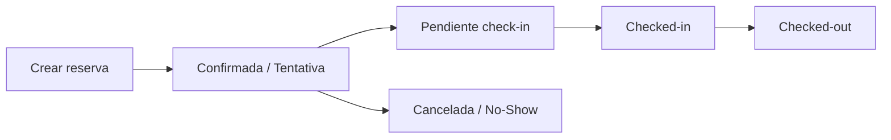

Las reservas son el elemento central del PMS. Desde el detalle de una reserva puedes gestionar todo el ciclo de vida de la estancia: creación, check-in, facturación y check-out.

<Card
  title="Abrir aplicación"
  icon="calendar"
  href="https://app.hotelgest.com/dashboard"
  ctaText="Ir al Dashboard"
/>

---

## Ciclo de vida de una reserva

---

## Crear una reserva

<Steps>
  <Step title="Acceso">
    Usa la **acción rápida** "Crear reserva" desde el Dashboard o el menú, **selecciona un rango** de fechas en el calendario de Planificación, o pulsa la tecla **P** en el calendario.
  </Step>
  <Step title="Datos básicos">
    Indica **fechas** (llegada y salida), **tipo de habitación**, **habitación** (opcional al crear) y **ocupación** (adultos, niños, bebés).
  </Step>
  <Step title="Régimen y política">
    Elige **régimen** (SA, AD, MP, PC, TI), **política** (Flexible o No Reembolsable), **origen** del canal y, si aplica, **código promocional** y **empresa/agencia**.
  </Step>
  <Step title="Notas">
    Añade **notas del cliente** (peticiones especiales) y **notas internas** (solo visibles para el personal).
  </Step>
</Steps>

### Régimen (Board)

<Tabs>
  <TabItem value="sa" label="SA">Solo Alojamiento / Room Only</TabItem>
  <TabItem value="ad" label="AD">Alojamiento y Desayuno / Bed &amp; Breakfast</TabItem>
  <TabItem value="mp" label="MP">Media Pensión / Half Board</TabItem>
  <TabItem value="pc" label="PC">Pensión Completa / Full Board</TabItem>
  <TabItem value="ti" label="TI">Todo Incluido / All Inclusive</TabItem>
</Tabs>

---

## Estados de la reserva

<AccordionGroup>
  <Accordion title="Confirmada (Ready)" icon="check-circle">
    Reserva confirmada y activa.
  </Accordion>
  <Accordion title="Tentativa (Tentative)" icon="clock">
    Reserva provisional, pendiente de confirmación.
  </Accordion>
  <Accordion title="Cancelada (Cancelled)" icon="x-circle">
    Reserva cancelada.
  </Accordion>
  <Accordion title="No-Show" icon="user-x">
    El huésped no se presentó.
  </Accordion>
</AccordionGroup>

---

## Estados de check-in

| Estado | Descripción |
|--------|-------------|
| **Pendiente de check-in** | Confirmada pero el huésped aún no ha llegado |
| **Esperando check-in** | El huésped ha iniciado el proceso (p. ej. registro online) |
| **Checked-in** | Huésped alojado |
| **Checked-out** | Huésped ha dejado el alojamiento |
| **Cancelado** | Check-in cancelado |

---

## Detalle de la reserva

Al hacer clic en una reserva se abre la vista de detalle.

<Columns size="2">
  <Column>
    <Card title="Columna izquierda" icon="panel-left" horizontal>
      **Cabecera:** Escanear huéspedes, estado check-in, Housekeeping, Editar, gestión de grupo, Llaves, Historial, Enviar recordatorio, Web App, WhatsApp, Autoridades.  
      **Perfil del cliente** y bloque de detalles (llegada, salida, ocupación, noches, política, régimen, teléfono). Indicadores de limpieza y avisos.
    </Card>
  </Column>
  <Column>
    <Card title="Columna derecha e inferior" icon="layout" horizontal>
      **Notas:** Tareas, notas de petición, notas internas, notas planas.  
      **Financiero:** Productos, Facturas y Proformas, Pagos y Depósitos.
    </Card>
  </Column>
</Columns>

---

## Escaneo de documentos

<Callout type="info" title="Tecnología Regula">
  El sistema extrae automáticamente nombre, apellidos, número de documento, nacionalidad y fecha de nacimiento del DNI o pasaporte. Cumple el registro de viajeros y puede enviar partes a las autoridades.
</Callout>

<Steps>
  <Step title="Abrir reserva y escanear">
    En el detalle de la reserva, haz clic en **Escanear huéspedes** y usa la cámara del dispositivo para capturar el documento.
  </Step>
  <Step title="Verificar datos">
    Revisa los datos extraídos y confirma. La firma digital se puede solicitar en el proceso de check-in.
  </Step>
</Steps>

---

## Datos del cliente y más

Cada reserva incluye: nombre, apellidos, email, teléfono, tipo y número de documento, nacionalidad, idioma, fecha de nacimiento, sexo, dirección y consentimiento de marketing. Se pueden adjuntar **imágenes** (documentos, daños, incidencias) y almacenar **tarjetas de crédito** de forma segura para garantía y cobros.

<Card
  title="Ver Planificación"
  icon="calendar"
  href="/03-planificacion"
  ctaText="Calendario y disponibilidad"
/>

<Card
  title="Ver Facturación"
  icon="receipt"
  href="/05-facturacion-y-pagos"
  ctaText="Facturas y pagos"
/>
